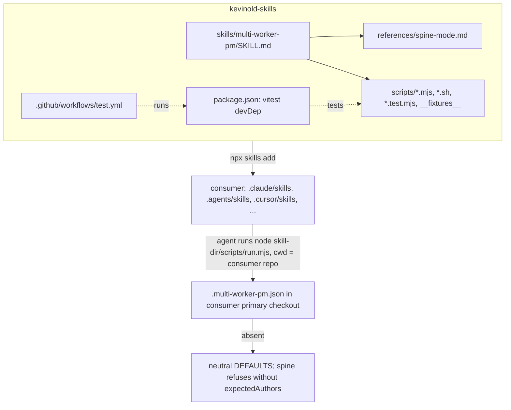

# Bootstrap kevinold-skills with a generalized multi-worker-pm - Plan

## Goal Capsule

- **Objective:** Any of Kevin's repos can get the latest multi-worker PM, plus future shared skills, into every coding agent it uses with one `npx skills add kevinold/skills`. The PM then works there with no source-repo assumptions baked in.
- **Means:** port the source repo's MWPM (skill, spine reference, scripts, tests) into `skills/multi-worker-pm/`. Bundle the scripts inside the skill folder (KTD1). Move every the source repo fact into config keys with neutral defaults (KTD2, KTD3).
- **Authority:** this plan, then the user's instructions in the planning session. The source repo's current MWPM (at `.claude/skills/multi-worker-pm/` and `scripts/multi-worker-pm/` there) is the behavioral reference. The old `kevinold/multi-worker-pm-skill` repo is reference only.
- **Execution profile:** one `/lfg`-style PR on this repo. Port first, generalize under the existing tests, then scaffold packaging.
- **Stop conditions:**
  - A source-repo test cannot be kept green after generalization without re-adding a source-repo literal.
  - `npx skills add` fails to install the skill with `scripts/` intact.
- **Tail ownership:** archiving or redirecting `kevinold/multi-worker-pm-skill` is operator-run, because it is an outward-facing action (see Deferred). The source repo keeps its own copy and is not touched.

---

## Product Contract

### Summary

Turn this empty repo into Kevin's shared skills collection, installable into Claude Code, Codex, Cursor, OpenCode, Gemini, Pi and the other agents `npx skills` supports. The first skill is the source repo's latest multi-worker PM: issues, renovate and spine lanes, the config loader and lifecycle labels. It is stripped of the source repo specifics, so a consumer repo supplies its policy through `.multi-worker-pm.json`. This repo replaces `multi-worker-pm-skill` as MWPM's source of truth.

### Problem Frame

MWPM has diverged into two copies. The public `multi-worker-pm-skill` repo holds an early version: select, classify and run only, 3 tests, no spine mode. The source repo holds the living version: SKILL.md at 375 lines, `references/spine-mode.md`, a config loader, about 20 shell helpers and 8 test files. The source repo's copy cannot be installed anywhere else:
- The skill invokes `scripts/multi-worker-pm/` relative to the consumer's repo root, and `npx skills` copies only the skill folder.
- Its config defaults are the source repo's values: `vitest` and `cypress-e2e/report` checks, the source repo's author logins, cloud-provider deploy settings, and the Cypress post-merge bar.
- Code and prose hardcode a non-default base branch, cloud-provider helpers, `scripts/claude-hooks/`, and source-repo issue numbers.

Kevin also wants one install that brings all his general skills to whichever agent a project uses, as `overdrive` does for its harness.

### Key Decisions

- KD1. **This repo is MWPM's single source of truth. The old repo is reference only.** (session-settled: user-directed — chosen over keeping `multi-worker-pm-skill` canonical and syncing into this repo: one install requires the skill to live here, and two canonical copies drift.) Governs R1, R9.
- KD2. **Source-repo specifics are generalized out of the skill entirely, not kept as defaults.** (session-settled: user-directed — chosen over keeping the source repo's values as built-in defaults: a consumer that forgets its config would otherwise inherit the source repo's identity and gates.) Governs R3, R4, R5, R6.
- KD3. **The source repo itself is not modified.** The source repo keeps running its own copy. Migrating the source repo onto this package is follow-up work. Governs R3.

### Requirements

**Packaging and install**

- R1. `npx skills add kevinold/skills` lists `multi-worker-pm` and installs it with its `scripts/` and `references/` subfolders into each selected agent's skills directory.
- R2. The repo layout is `skills/<name>/SKILL.md`, and adding a second skill needs no packaging change: a new folder is enough.

**MWPM parity**

- R3. The ported skill keeps every capability of the source repo's current version:
  - issues, renovate and spine lanes
  - agent-lifecycle labels
  - claim lease
  - config loader and its trust model (digest, drift refusal, protected config path)
  - herdr tab/workspace labeling
  - the safety rules
- R4. Every skill instruction that runs a helper resolves it relative to the installed skill directory, never the consumer repo's root.

**Generalization**

- R5. No source-repo fact remains in skill prose, scripts or defaults. That covers:
  - org and repo names
  - the source repo's bot and author logins
  - a hardcoded base-branch name
  - cloud-provider services and auth
  - `cypress-e2e`, `vitest` as a required check
  - vendor-specific paths, `scripts/claude-hooks/`
  - internal release tooling
  - source-repo issue numbers and docs paths

  A guard test enforces this.
- R6. With no config file, the PM uses neutral defaults:
  - base branch `main`
  - no required check names beyond "all checks green"
  - no preview context
  - push-mode post-merge bar
  - no worker env files
  - no cloud cleanup

  Any mode that needs repo-specific trust facts refuses to start with a named error rather than guessing. Today that means spine mode's expected state-comment authors.
- R7. Repo policy that was hardcoded becomes config: base branch, protected branches, extra danger paths, extra protected paths, worker agent kind, and an optional deny-hook command for the preflight assertion.

**Repo hygiene**

- R8. Tests run from the repo root with one command and in CI on every push, and every time-dependent test runs against a globally frozen clock.
- R9. The README documents install (`npx skills`), each skill's prerequisites, MWPM config keys with an example, and how to add a skill.

### Scope Boundaries

- No changes to the source repo (KD3).
- No Claude/Codex plugin manifests or marketplace entries: `npx skills` covers the agents.
- Only MWPM moves in now. Other skills are added later per R2.

### Deferred to Follow-Up Work

- Archive `kevinold/multi-worker-pm-skill`, or replace its README with a pointer here. Operator-run, because it is outward-facing.
- Move the source repo onto this package. This takes more than adding a config file. Prerequisites:
  - a migration or alias for the source repo's existing base-named state comments (KTD4)
  - a deploy-wait hook to replace the deploy-wait flag (KTD5)
  - the source repo's removed DEFAULTS copied into its `.multi-worker-pm.json`
  - a freeze on MWPM edits in the source repo until the cutover, so the two copies do not drift
- A generic "preview environment cleanup" hook to replace the removed cloud-provider branch/job helpers.
- A generic pre-dispatch "await deploy" hook to replace the deploy-wait flag. Until it exists, the dispatch-mode bar starts right after merge, so the dispatched workflow has to wait for its own target deploy. SKILL.md and the README say so.
- Shipping a portable mutation-deny hook (the source repo's `deny-mutation-verbs.mjs` is Claude-Code-and-AWS specific).
- Migrating other skills from `~/.claude/skills` (e.g. `whats-next`, `orch8`, `meeting-notes`, `prfaq`) after a generality review.
- Verifying non-`claude` worker kinds (`workerKind`) end to end.

### Success Criteria

- A fresh scratch repo runs `npx skills add <this repo> --all`, then `node <agent-skills-dir>/multi-worker-pm/scripts/run.mjs select --dry-run`-equivalent from inside a GitHub checkout, and gets a selection without the source repo references.
- A grep of `skills/` for the R5 literal list returns nothing outside test fixtures that use neutral placeholder names.

---

## Planning Contract

### Key Technical Decisions

- KTD1. **Scripts live at `skills/multi-worker-pm/scripts/`. SKILL.md refers to them as `<skill-dir>/scripts/...`, with one instruction to resolve `<skill-dir>` as the directory containing SKILL.md.** Evidence:
  - The `npx skills` probe on 2026-09-26 showed nested `scripts/sub/` copied into all agent dirs.
  - Shell helpers already find siblings via `$(dirname "$0")`, and `.mjs` imports are sibling-only, so the move breaks only prose and path-pinned allow rules. Governs R1, R4.
- KTD2. **Neutral defaults, plus required keys where a guess is unsafe.**
  - `config.mjs` DEFAULTS become the R6 list.
  - Empty `checks.required` is allowed and means "at least one check reported and every reported check succeeded". Zero reported checks is never green. This keeps the source repo's fail-closed guard in `deriveChecksFromRollup`.
  - `identity.expectedAuthors` has no default, and spine mode refuses with `config-missing: identity.expectedAuthors`, because it authenticates `state:` comments.
  - Governs R5, R6.
- KTD3. **New config keys, not env vars:**
  - `baseBranch` (default `main`)
  - `protectedBranches` (default `[baseBranch]`)
  - `dangerPaths` (appended to the generic list)
  - `protectedPaths` (appended to spine's protected prefixes)
  - `workerKind` (default `claude`)
  - `denyHook` (optional)

  The old repo's `MWPM_BASE_BRANCH` env is dropped. Config already has digest, drift and protected-path trust (R3), and env vars bypass it. Governs R7.
- KTD4. **State names tied to the old base branch become `base-verified`/`base-regressed`.** No consumer of this package has existing state comments, and the source repo is not migrating now (KD3). Governs R5.
- KTD5. **Cloud-provider-specific code is deleted, not configured:**
  - the cloud deploy-job watcher script
  - `close-lane.sh --delete-branch`
  - the `aws` block
  - the deploy-wait flag
  - the cloud prompt clause
  - the orphaned cloud-resource cleanup references

  Generic cloud cleanup is deferred. Governs R5.
- KTD6. **Keep vitest as a root devDependency, rather than converting to `node --test` plus a shim.** This deviates from the call-out default. The research found 8 test files using `it.each`, `it.skipIf`, fake timers, about 30 message-arg `expect`s and 8 matchers the old shim lacks, so a zero-diff test port beats a 60-line shim. A root `vitest.config` with a setup file freezes the clock globally (R8). The `process.env.VITEST` guard in `run.mjs` stays valid.
- KTD7. **The dirty-tree check covers the config file, plus the installed skill dir only when that dir is inside the primary checkout.** A project-level install such as `.claude/skills/multi-worker-pm/` or `.agents/skills/...` is vendored and can drift. A global install is outside the repo and is skipped. A project-level install therefore has to be committed before spine start, and the README says so. Both call sites apply this rule: the `run.mjs` start gate and `pull-primary.sh`. Protected prefixes add `.agents/` alongside `.claude/`. Governs R3.
- KTD8. **Tests ship inside the skill folder beside the scripts, and each shipped test is self-contained.** Excluding them would mean rewriting relative fixture paths. Consumer vitest runs pick up `**/*.test.mjs`, so the shipped tests must not depend on this repo's setup file: `spine.test.mjs` keeps its own clock freeze in addition to the global one. The README tells consumers who install at project level to exclude `.claude/skills/**` and `.agents/skills/**` from their test runner.

### High-Level Technical Design



### Output Structure

```text
README.md
LICENSE
package.json
vitest.config.mjs
test/setup.mjs                      # global FROZEN_NOW
.github/workflows/test.yml
skills/multi-worker-pm/
  SKILL.md
  config.example.json
  references/spine-mode.md
  scripts/                          # source repo's scripts/multi-worker-pm/ minus cloud-provider helpers
    __fixtures__/
```

### Assumptions

- The GitHub repo is `kevinold/skills` and public, so `npx skills add kevinold/skills` resolves.
- License is MIT, matching `multi-worker-pm-skill` and `overdrive`.
- Workers still run `/ce-worktree` + `/lfg` / `/ce-babysit-pr`, so compound-engineering is a documented prerequisite, as in the old README.

---

## Implementation Units

### U1. Repo scaffold and test harness

- **Goal:** root files that make the repo an `npx skills` package with a working test command.
- **Requirements:** R2, R8, R9 (skeleton)
- **Dependencies:** none
- **Files:**
  - `package.json`
  - `vitest.config.mjs`
  - `test/setup.mjs`
  - `LICENSE`
  - `.gitignore`
  - `.github/workflows/test.yml`
  - `README.md`
- **Approach:**
  1. `package.json`: private, `type: module`, vitest devDependency, `test` script scoped to `skills/**/*.test.mjs`. Pin the node engine to ≥22, since the deny-hook note and `structuredClone` need modern Node.
  2. Setup file: export `FROZEN_NOW`, a mid-month weekday such as 2026-09-16T12:00:00Z. Use `vi.useFakeTimers({ toFake: ['Date'] })` + `setSystemTime` in `beforeEach` and restore in `afterEach`.
  3. CI: checkout, setup-node from `engines`, `npm ci`, `npm test`.
- **Patterns to follow:** `overdrive/README.md` install table and tone. The prerequisites table in `multi-worker-pm-skill/README.md`.
- **Test expectation:** none (scaffolding). The harness is proven by U2's tests running.
- **Verification:** `npm test` runs, even with zero tests, and CI is green on the first push.

### U2. Port source-repo MWPM verbatim into the skill folder

- **Goal:** the source repo's current skill and scripts live under `skills/multi-worker-pm/` and all ported tests pass before any generalization.
- **Requirements:** R3
- **Dependencies:** U1
- **Files:**
  - `skills/multi-worker-pm/SKILL.md`
  - `skills/multi-worker-pm/references/spine-mode.md`
  - `skills/multi-worker-pm/scripts/*.{mjs,sh}`
  - `skills/multi-worker-pm/scripts/*.test.mjs`
  - `skills/multi-worker-pm/scripts/__fixtures__/*`
- **Approach:**
  1. Copy from the source repo's `.claude/skills/multi-worker-pm/` and `scripts/multi-worker-pm/` at the source repo's current HEAD, and record the source SHA in the commit message.
  2. Repoint the test-only relative reads. In `run.test.mjs`, both prose documents go to `../SKILL.md` and `../references/spine-mode.md`, and `it.skipIf(!existsSync(...))` becomes a plain `it` so a wrong path fails instead of skipping. The `whats-next.md` drift test in `select.test.mjs` is deleted, because that command is not shipped.
  3. Add the global clock setup, and keep `spine.test.mjs`'s own freeze (KTD8).
- **Execution note:** characterization first. This unit proves parity. U3 changes behavior under these same tests.
- **Test scenarios:**
  - All 8 source-repo test files pass unchanged apart from the path repoints above.
  - `portability.test.mjs` sibling-import guard passes at the new location.
- **Verification:** `npm test` is green, and the file list matches the source repo minus nothing.

### U3. Generalize config, scripts and defaults

- **Goal:** scripts carry no source-repo facts, and repo policy comes from config with neutral defaults.
- **Requirements:** R5, R6, R7, R3
- **Dependencies:** U2
- **Files:**
  - `skills/multi-worker-pm/scripts/config.mjs`, `config.test.mjs`
  - `skills/multi-worker-pm/scripts/run.mjs`, `run.test.mjs`
  - `skills/multi-worker-pm/scripts/spine.mjs`, `spine.test.mjs`
  - `skills/multi-worker-pm/scripts/select.mjs`, `select.test.mjs`
  - `skills/multi-worker-pm/scripts/dispatch-workflow.sh`, `select-push-run.sh`, `pull-primary.sh`, `post-state.sh`, `close-lane.sh`, `spawn-worker.sh`, `set-agent-label.sh`, `clean-panes.sh`
  - `skills/multi-worker-pm/scripts/portability.test.mjs`, `close-lane.test.mjs`, `spawn-worker.test.mjs`
  - `skills/multi-worker-pm/scripts/__fixtures__/*`
  - delete `the cloud deploy-job watcher script`
  - `skills/multi-worker-pm/config.example.json`
- **Approach:**
  1. `config.mjs`: neutral DEFAULTS (KTD2). Add the KTD3 keys with validation. Drop the `aws` block and the deploy-wait flag (KTD5). Rename the source repo's provenance key to an ignored `_meta`. Allow empty `checks.required`.
  2. Thread `baseBranch` through every hardcoded base-branch literal in `run.mjs`, `spine.mjs` and the `.sh` helpers. Thread `protectedBranches` through preflight.
  3. Rename state names (KTD4).
  4. `select.mjs`: generic DANGER_PATHS (`.github/workflows/`, lockfiles, infra dirs), and append `dangerPaths` from config. Remove the vendor-specific and cloud-provider entries.
  5. `spine.mjs` PROTECTED_PREFIXES: `.claude/`, `.agents/`, `.github/workflows/`, `.husky/`, the config file, and `protectedPaths` from config. Remove `scripts/claude-hooks/` and `scripts/multi-worker-pm/`.
  6. Dirty check per KTD7, in both `run.mjs` and `pull-primary.sh`. `pull-primary.sh` resolves the skill dir from `$HERE/..`.
  7. `spawn-worker.sh`: `--kind` from `workerKind`.
  8. `pull-primary.sh --assert-hooks`: assert the configured `denyHook` string. When it is unset, print a warning and skip the assertion.
  9. Strip source-repo issue numbers and anecdotes from comments.
  10. Fixtures and inline test literals: rename owners, bots and authors to `acme/app` / `acme-bot` / `alice` in `__fixtures__/*.json` and in `*.test.mjs`. The source-repo config fixture becomes a "full" fixture with neutral values.
  11. `portability.test.mjs`:
      - Build one literal list covering the full R5 set: the old base-branch name, cloud-provider names, `claude-hooks`, the source org, bot and author names, vendor and internal-tool names, `cypress-e2e`, `vitest` as a check name.
      - Remove the DEFAULTS-block exemption, the source-literal-ok marker and the "source defaults" fence exemption.
      - Scan `SKILL.md`, `references/` and the identity literals in `*.test.mjs`.
      - Flip the self-test so a literal inside DEFAULTS now fails.
- **Execution note:** test-first per moved rule. Update or add the failing test, then change the code.
- **Patterns to follow:** existing `loadPmConfig` validation style and `PmConfigError` naming. Existing PATH-shim CLI tests for the `.sh` helpers.
- **Test scenarios:**
  - No config file → loader returns neutral defaults: base `main`, empty required checks, null preview context, push bar.
  - Config sets `baseBranch: "develop"` → the start gate, `select-push-run.sh` and `dispatch-workflow.sh` query `develop`, and a PR whose base is `main` is rejected with the base-mismatch reason.
  - Spine start with no `identity.expectedAuthors` → refuses with a named config error. Issues mode with the same config runs.
  - Empty `checks.required` + all reported checks success → lane green. One failing check → not green. Zero reported checks → not green.
  - `dangerPaths: ["infra/"]` → an issue whose expected files touch `infra/x.tf` is classified dangerous.
  - `protectedPaths: ["ops/"]` → a lane diff touching `ops/a` reports `protected-path`. A diff touching `.agents/skills/x` also reports it.
  - Unknown key or an `aws` key in config → `PmConfigError` naming the key.
  - `workerKind: "codex"` → spawn-worker invokes `herdr agent start ... --kind codex`.
  - `denyHook` unset → `pull-primary.sh --assert-hooks` warns and exits 0. When it is set and absent from settings → exits non-zero naming the hook.
  - The skill dir is inside the primary with an uncommitted edit → the start gate refuses as dirty. A global install outside the primary → no dirty check on it.
  - Portability guard: any R5 literal in `scripts/` (DEFAULTS included), `SKILL.md`, `references/`, or an identity literal in `*.test.mjs` fails the test.
- **Verification:** `npm test` is green and the portability guard passes with the extended literal list.

### U4. Generalize skill prose and path resolution

- **Goal:** SKILL.md and spine-mode.md run helpers from the installed skill dir and read as repo-agnostic.
- **Requirements:** R4, R5, R3
- **Dependencies:** U3
- **Files:**
  - `skills/multi-worker-pm/SKILL.md`
  - `skills/multi-worker-pm/references/spine-mode.md`
- **Approach:**
  1. Add a short "Locating helpers" section near the top: resolve `<skill-dir>` as the folder containing this SKILL.md, and run every helper as `node <skill-dir>/scripts/run.mjs …` / `bash <skill-dir>/scripts/<x>.sh …` with cwd inside the consumer's primary checkout.
  2. Replace every `scripts/multi-worker-pm/` invocation with that form (KTD1). Reword the preflight existence check to `test -e <skill-dir>/scripts/run.mjs`.
  3. Replace hardcoded branch wording with "the base branch" and "protected branches" per config. Remove the cloud-provider, orphaned cloud-resource cleanup, internal-tool references, `npm run fix:lockfile` and source-repo-anecdote passages.
  4. Renovate lane: the lockfile repair command becomes the ecosystem-generic `npm install --package-lock-only --ignore-scripts`, or config if a repo needs another.
  5. Rewrite the path-pinned allow-rule example to use the project-level install path `.claude/skills/multi-worker-pm/scripts/merge-lane.sh`, with a note that global installs pin `~/.claude/skills/...`.
  6. Refresh `description` to say "coding-agent session" rather than "Claude Code session", because the skill installs into many agents while workers are herdr-launched per `workerKind`.
- **Test scenarios:**
  - Portability guard from U3 covers prose literals.
  - `run.test.mjs`'s SKILL.md drift test still passes against the new text.
- **Verification:** a grep for `scripts/multi-worker-pm/` in `skills/` returns nothing, and the tests stay green.

### U5. README, config example and install smoke check

- **Goal:** a new user can install and configure MWPM from the README alone, and the install path is proven.
- **Requirements:** R1, R2, R9
- **Dependencies:** U4
- **Files:**
  - `README.md`
  - `skills/multi-worker-pm/config.example.json`
- **Approach:**
  1. README sections:
     - What this is
     - Install: `npx skills add kevinold/skills`, plus `-s multi-worker-pm`, `-a claude-code codex`, `-g`
     - Skills table
     - MWPM prerequisites: `gh`, `node` ≥22, `jq`, herdr, compound-engineering
     - MWPM config key reference, linking `config.example.json`. It notes that the dispatch bar does not wait for deploys.
     - Project-level installs: commit the installed skill dir before running spine mode (KTD7), and exclude it from your test runner (KTD8).
     - Adding a skill: folder + SKILL.md frontmatter `name`/`description`, run `npx skills add . --list`
     - Updating (`npx skills update`)
  2. The config example shows every key, including a filled `identity.expectedAuthors` and a dispatch-mode bar.
- **Execution note:** packaging. Prefer install smoke verification over unit coverage.
- **Test expectation:** none (docs). The smoke check below is the proof.
- **Verification:**
  - `npx skills add . --list` from the repo lists `multi-worker-pm`.
  - `npx skills add <repo path> --all --copy` into a throwaway git repo places `multi-worker-pm/scripts/run.mjs` and `references/spine-mode.md` under `.claude/skills/` and `.agents/skills/`.
  - Running the installed `run.mjs select` against a GitHub checkout starts, and fails only on missing `gh` auth or prerequisites, never on path resolution.

---

## Verification Contract

| Gate | Command / check | Applies to |
|---|---|---|
| Unit + CLI tests | `npm test` (vitest, globally frozen clock) | U2, U3, U4 |
| Source-literal guard | `portability.test.mjs` with the extended list | U3, U4 |
| Skill discovery | `npx skills add . --list` shows `multi-worker-pm` | U5 |
| Install smoke | `npx skills add <path> --all --copy` in a scratch repo; `scripts/` and `references/` present | U5 |
| CI | `.github/workflows/test.yml` green on the PR | all |

## Definition of Done

- U1–U5 verification met, and CI green.
- No R5 literal in `skills/` (guard test enforced).
- The cloud-provider helpers and the `aws` block are gone, not dead-flagged, and no abandoned experiment code is left in the diff.
- The README install command works against the pushed repo.
- The plan file under `docs/plans/` is committed with the work.
