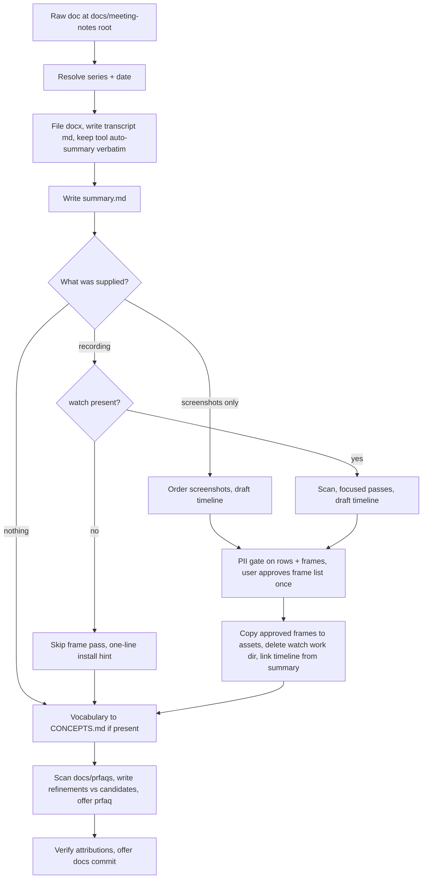
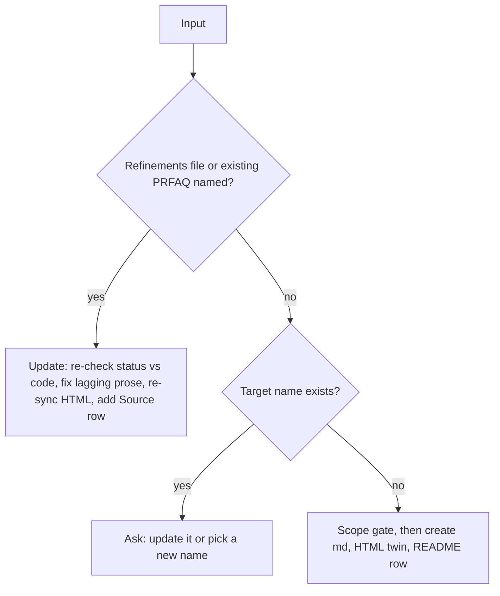

# Public meeting-notes and prfaq skills with a video pass - Plan

## Goal Capsule

- **Objective:** Any repo can run `npx skills add kevinold/skills` and get two aligned skills. One turns a raw meeting (transcript, plus the recording when there is one) into a PM-grade summary with a screen-share timeline. The other turns the meeting's outcomes into honest PRFAQs. Neither leaks any private org's names, data or conventions.
- **Means:** port the user-level `meeting-notes` and `prfaq` skills into `skills/`, reconcile them with the originals in the first private source repo, and add a video pass built on the external `watch` skill (KTD1, KTD3). Gate committed frames and timeline text for PII (KTD4). Guard the result with a repo-level test (KTD7).
- **Authority:** this plan, then the user's instructions in the planning session. The behavioral references are the user-level skills in `~/.claude/skills/{meeting-notes,prfaq}` and two private source repos the operator has locally: source A holds the original skills and a PRFAQ-authoring convention doc, and source B holds the recent screen-share timelines. All of them are read only and never copied verbatim, and this public plan does not name them.
- **Execution profile:** one PR on this repo. Port and sanitize first, then align the two contracts, then add the video pass, then tests and README.
- **Stop conditions:**
  - A rule from a private source can't be expressed without naming that org, a person, or a vendor.
  - `watch`'s invocation contract (flags, exit codes, output layout) differs from what KTD3 assumes.
- **Tail ownership:** swapping the user-level `~/.claude/skills/{meeting-notes,prfaq}` and the private source repos' copies onto this package is operator-run follow-up (see Deferred).

---

## Product Contract

### Summary

Add `skills/meeting-notes` and `skills/prfaq` to the public skills repo. `meeting-notes` files a transcript into `docs/meeting-notes/<series>/<date>/` and writes a PM-grade summary: decisions with their reasons, disagreements with where they landed, open questions and action items, all attributed by speaker and timestamp. When a recording or a notetaker's screenshots exist, a new video pass writes `<date>-screen-timeline.md` and commits only frames that clear a PII gate. The summary ends by splitting the meeting's output into refinements to existing PRFAQs and net-new PRFAQ candidates. `prfaq` writes those PRFAQs (a canonical Markdown file plus a self-contained HTML twin) and can also apply a refinements file to existing ones. Both skills share one promotion bar and one status legend.

### Problem Frame

The two skills exist only as private copies that have drifted:
- The user-level copies were partly genericized from source A but still carry a notetaker vendor's name, "founders", real people and quotes from a private meeting, and a CRM vendor's name. Their status legend is split: the prfaq SKILL.md says BUILT/PARTIAL/PLANNED, while its template, HTML shell and promotion bar still say LIVE/ROADMAP. The HTML shell also has a dead `#b` nav anchor.
- Source B's practice of reading the recording (screen-share timelines, committed frames) lives only in past output files, not in any skill. It already caused one incident, where a frame and timeline text exposing production customer data were committed and had to be scrubbed.
- `meeting-notes` writes a refinements file that nothing consumes, because `prfaq` can only create new documents.

The user wants one public version, installable anywhere, that does all of this well.

### Key Decisions

- KD1. **`watch` (bradautomates/claude-video) is a declared prerequisite, not vendored.** (session-settled: user-approved — chosen over copying it into this repo: a copy would mean maintaining a fork of a third-party MIT skill.) Governs R9, R10, R20.
- KD2. **Video sources are a local file or URL through `watch`, with notetaker screenshots as a vendor-neutral fallback.** (session-settled: user-approved — chosen over naming a specific notetaker's API: the public skill must not assume one vendor.) Governs R8, R11.
- KD3. **The PII gate is on by default.** (session-settled: user-approved — chosen over committing frames freely: a prior incident in source B showed that a leak through a frame or its row text is easy to commit and hard to notice.) Governs R12, R13.
- KD4. **Status markers describe build state, never production:** 🟢 BUILT, 🟡 PARTIAL, 🔵 PLANNED. Source A's LIVE/ROADMAP is retired. Governs R5.

### Requirements

**Packaging and sanitization**

- R1. `npx skills add kevinold/skills` lists `meeting-notes` and `prfaq`, and each installs with its `references/` folder intact.
- R2. Each skill is self-contained: no link or instruction depends on a file outside its own folder. Where both skills need the same rule, each carries its own copy.
- R3. Neither skill names any private org, person, customer, CRM portal, meeting ID, local path, internal host, branch rule or issue tracker from its source repos. A test enforces this.

**Aligned contract**

- R4. Both skills share one promotion bar (big AND cross-team AND genuinely debated), stated identically in each skill's copy.
- R5. The status legend is BUILT/PARTIAL/PLANNED in every file of both skills (per KD4). Each status row carries a real repo-relative `Where` path, found by searching the code rather than recalled.
- R6. The handoff works end to end: `meeting-notes` writes a closing refinements-vs-candidates section and an optional `<date>-prfaq-refinements.md`, and `prfaq` accepts both a candidate and a refinements file as input. With a refinements file, `prfaq` updates the existing PRFAQ in place. It re-checks each status against the code, fixes prose that lags the table, re-syncs the HTML twin, and adds the meeting to the Source index.
- R7. One citation format everywhere: `(Speaker, ~M:SS)`, or `~H:MM:SS` past the hour. `docs/prfaqs/README.md` is a single index table with a Source column, so a PRFAQ written from a conversation has a row too.

**Video pass (meeting-notes)**

- R8. When a recording (local file or URL) or notetaker screenshots are supplied, `meeting-notes` writes `<date>-screen-timeline.md`. It has a header (source by basename, method, redaction note, sharers with the on-screen evidence for each, clock offset or "unverified") and a table with the columns `Time | Sharer | Surface | What's visible | Committed`.
- R9. The pass runs `watch` and never uploads meeting audio. A transcript already exists, so `watch` always gets `--no-whisper`.
- R10. With `watch` missing, the transcript and summary are still filed. A recording's frame pass is skipped with a one-line install hint. Screenshot-only input still gets its timeline, because it needs no `watch` (KD2).
- R11. Screenshots without timestamps become ordered rows marked "time unknown". A URL that needs a login gets one attempt, then the user is asked for a local file.
- R12. The PII gate checks both frames and the text of each timeline row before anything is committed. A frame is committed only if it shows a diagram, a public page, or dev/test/fictional data. The user approves the proposed frame list once, as a whole. No row text may carry customer or personal names, production records, emails or absolute paths.
- R13. Recordings are never moved into, copied into, or committed to the repo. `watch`'s working directory lives outside the repo and is deleted even when the pass fails.
- R14. The video pass can run on its own for a meeting that is already filed. It then adds the timeline and one summary metadata line and does not regenerate the summary.
- R15. The summary links the timeline from its metadata block (`**Recording + screen timeline:**`), and the video pass runs before the PRFAQ handoff.

**Carried rules (meeting-notes)**

- R16. The file taxonomy, date precedence, U+2028 handling, source auto-summary preserved verbatim as `<date>-<tool>-summary.md`, and the never-retro-rename and frozen-H2-anchor rules all carry over from the user-level skill. They are phrased neutrally, with no vendor or team names.
- R17. When `CONCEPTS.md` exists, vocabulary decisions go into both the summary and `CONCEPTS.md`. When it doesn't, they stay in the summary only and the skill does not create the file.
- R18. Every attribution and timestamp in the summary and the timeline is checked against the transcript before the skill finishes.

**Carried rules (prfaq)**

- R19. `prfaq` refuses to overwrite an existing `<name>-prfaq.md`. It routes to the update path (R6) or asks for a new name. The HTML twin is built from the finished Markdown and says the same things.

**Docs**

- R20. The README gains a Skills-table row and a `## <name>` section (Prerequisites, Configuration, Usage) for each skill, matching the `multi-worker-pm` section. `meeting-notes` lists `watch` with its install commands and `ffmpeg`/`yt-dlp`.

### Acceptance Examples

- AE1. Covers R9, R10. **Given** `watch` is not installed, **when** the user files a transcript and points at a recording, **then** the transcript and summary are filed, no timeline is written, and one line tells the user how to install `watch`.
- AE2. Covers R12, R13. **Given** a recording whose share shows a production CRM record and a bookmarks bar, **when** the video pass runs, **then** that frame is proposed as `no (production record)`, the row text is written generically, and nothing is copied to `assets/` before the user approves the list.
- AE3. Covers R6, R19. **Given** a meeting that re-debated a topic with an existing PRFAQ, **when** `prfaq` is run with the refinements file, **then** that PRFAQ is updated in place: each status is re-checked against the code, the Source index gains the meeting, and the HTML twin matches.
- AE4. Covers R14. **Given** a meeting summary committed yesterday, **when** the recording arrives and the user runs the video pass, **then** only the timeline, the approved frames and one metadata line are added, and the H2 anchors are unchanged.

### Scope Boundaries

- Porting source B's roadmap-sync skill or any roadmap, issue-tracker or CRM automation.
- Editing either private source repo or the user-level skill copies.
- A raw-ffmpeg fallback when `watch` is missing. Considered and not built: `watch` is the dependency the user named, and a second frame path doubles the surface. It would come back if `watch` proves unreliable on long local recordings.
- Automated PII detection (OCR or classifiers). Considered and not built: the gate is a reviewed checklist plus user approval, which is how the incident was actually caught. It would come back if frames are committed without review.

#### Deferred to Follow-Up Work

- Replace `~/.claude/skills/{meeting-notes,prfaq}` with installs from this package, then point both private source repos at it (operator-run).
- Add a repo-level size check for staged binaries across all skills.

---

## Planning Contract

### Key Technical Decisions

- KTD1. **Two independent skill folders, with the shared promotion bar duplicated byte-for-byte.** Installs copy one folder, so a cross-skill link would break (R2). A repo test pins both copies as identical (KTD7).
- KTD2. **Base each port on the user-level copy, not source A's.** The user-level copy already carries the later rules (production banner, parity-by-construction, `pandoc` fallback, promotion-bar reference). Source A contributes its convention doc's rules (spine cross-links, scope gate, codebase-grounded status), rewritten neutrally with invented examples.
- KTD3. **The video pass lives in `meeting-notes/references/video-pass.md` and drives `watch` through its own SKILL.md.** The pass resolves `watch`'s `SKILL_DIR` at runtime and never hardcodes a path. Method:
  1. Locate `watch`: use the harness's skill loader when one exists; otherwise take the first `SKILL.md` with a sibling `scripts/watch.py` under the known install roots (`~/.claude/plugins/cache/*/watch/*/skills/watch`, `~/.claude/skills/watch`, `~/.agents/skills/watch`, `~/.codex/skills/watch`, `./.claude/skills/watch`). If none is found, `watch` is missing (R10).
  2. Run `watch`'s setup check. Exit 3 (no Whisper key) is fine; exit 2 or 4 skips the recording pass (R10).
  3. Every `watch` call gets `--no-whisper`, the scan included (R9), and an explicit `--detail` and `--max-frames` so the user's `watch` config can't change the budget.
  4. Do a full-length scan with `--max-frames ceil(duration_s/60)` to find the share windows.
  5. Run a focused pass per window: `--start`/`--end`, `--detail balanced`, `--max-frames ceil(window_s/20)`, at `watch`'s default 512px. Re-grab only the frames whose text must be read (row content or the PII check) at `--resolution 1024` via `--timestamps`.
  6. Add up the planned frames before running, and ask if the total exceeds 150 frames at 512px.
  7. Collapse identical frames into one row, noting the row doesn't prove nothing changed between samples.
  8. Make one temp parent directory outside the repo, and give the scan and each pass their own `--out-dir` subdirectory. `watch` deletes the earlier `frame_*.jpg` files in an out-dir on every run, so a shared one keeps only the last window. Name frames `HH-MM-SS` from the `t=` timestamps in `watch`'s report. For a URL, the focused passes read the file the scan downloaded, not the URL. Delete the parent on exit.

  Source B's two-pass ffmpeg method (60 s everywhere, then 20 s inside share windows) is the model for these steps.
- KTD4. **The PII gate is a checklist plus a single approval of the frame list, applied to frames and row text alike.** The checklist lives in `references/video-pass.md`:
  - Allowed to commit: diagrams, public docs, dev/test/fictional data.
  - Things that leak by accident: bookmarks bars, tab titles, notetaker recording lists, account avatars, emails, local paths, production CRM or database records.
  - Committed frames go to `assets/video-frames/HH-MM-SS.jpg`.

  After frames are dropped, the pass checks that no links point at them.
- KTD5. **Timeline file shape follows source B's newest timeline file**, the newest one with a Committed column. Its sections are the header fields in R8, bold chapter separator rows, and an optional `## Surfaces seen` table. It records the source by basename only, dropping the absolute paths an older file leaked.
- KTD6. **`prfaq` gets two modes, create and update, chosen by its input.** A candidate or a conversation means create. A `*-prfaq-refinements.md` or an existing PRFAQ name means update. Update edits in place and never renames, because anchors are frozen.
- KTD7. **One repo-level test file, `test/meeting-prfaq.test.mjs`, with `vitest.config.mjs` extended to `test/**/*.test.mjs`.** The test sits outside both skills, so consumers never install it and the cross-skill checks have a home. It runs:
  - A private-literal sweep over both skill folders and the plans this PR adds under `docs/plans/`.
  - A byte-equality check of the two promotion bars.
  - A check that every relative link in each skill resolves inside that skill. Link targets containing a `<...>` placeholder are exempt, and template example links (a sibling PRFAQ, the notes back-link) must use one.
  - A check that `LIVE` and `ROADMAP` never appear as status markers.

  The private list (org, product, people, seed orgs, vendors, hosts, the internal CD-skip tag) is stored only as SHA-256 hashes of lowercased tokens. The sweep hashes each lowercased word and each 2–3-word n-gram of the scanned files and compares. Base64 would publish the names in this public repo, since anyone can decode it. The self-tests plant a synthetic token and add its hash inside the test.

### High-Level Technical Design

Meeting-notes run order, including the new pass and the handoff:



`prfaq` mode selection:



### Output Structure

```text
skills/
  meeting-notes/
    SKILL.md
    references/
      summary-spec.md
      prfaq-promotion-bar.md
      video-pass.md
  prfaq/
    SKILL.md
    references/
      prfaq-template.md
      prfaq-promotion-bar.md
      prfaq-html-twin-shell.html
test/
  meeting-prfaq.test.mjs
```

### Assumptions

- `watch` 0.2.0's flags (`--detail`, `--start`/`--end`, `--resolution`, `--no-whisper`, `--out-dir`, `--max-frames`) and setup-check exit codes (2 and 4 fatal, 3 advisory) stay stable. This was checked against the installed copy.
- The 150-frame ceiling is a default the user can raise mid-run.

---

## Implementation Units

### U1. Port and sanitize meeting-notes

- **Goal:** `skills/meeting-notes/` exists, with the carried rules phrased neutrally.
- **Requirements:** R1, R3, R16, R17, R18
- **Dependencies:** none
- **Files:** `skills/meeting-notes/SKILL.md`, `skills/meeting-notes/references/summary-spec.md`, `skills/meeting-notes/references/prfaq-promotion-bar.md`
- **Approach:**
  1. Start from the user-level copy (KTD2).
  2. Make the auto-summary rule tool-neutral (`<date>-<tool>-summary.md`), and replace "founders" with "the team".
  3. Replace the private names and quote in the summary-spec examples with invented ones.
  4. Add the U+2028 note and the rule to verify every attribution after writing (R18).
  5. Make `CONCEPTS.md` conditional per R17, and drop the claim that ce-compound owns it.
  6. Widen the input list to Teams, Zoom, Meet and generic `.md`/`.txt` exports.
  7. Add the rule that recordings are never filed (R13).
- **Patterns to follow:** `skills/multi-worker-pm/SKILL.md` frontmatter; `~/.claude/skills/meeting-notes/` structure.
- **Test scenarios:** covered by U5's sweep and link checks, which include this folder.
- **Verification:** the folder reads coherently standalone, and every reference link resolves.

### U2. Port, sanitize and align prfaq

- **Goal:** `skills/prfaq/` has one status legend, a working HTML shell, and create and update modes.
- **Requirements:** R1, R3, R4, R5, R6, R7, R19
- **Dependencies:** U1 (it ports the promotion bar from the user-level copy; U2 folds in source A's rules and copies the final text to both skills)
- **Files:** `skills/prfaq/SKILL.md`, `skills/prfaq/references/prfaq-template.md`, `skills/prfaq/references/prfaq-promotion-bar.md`, `skills/prfaq/references/prfaq-html-twin-shell.html`, `skills/meeting-notes/references/prfaq-promotion-bar.md`
- **Approach:**
  1. Replace LIVE/ROADMAP with BUILT/PARTIAL/PLANNED in the template, the shell, and both promotion bars (KD4).
  2. Fix the `#b` nav anchor.
  3. Remove the CRM vendor name from the template.
  4. Settle on "exactly one illustrative testimonial" in both files.
  5. Add the update mode and the refusal to overwrite (KTD6).
  6. Make the README registry a single table with a Source column (R7).
  7. Set the notes back-link format to a path relative to `docs/prfaqs/`.
  8. For conversation-sourced PRFAQs, quote the user only with their consent and never leave a status path blank.
  9. Fold source A's spine cross-link and scope-gate rules into the promotion bar, then copy it byte-for-byte into both skills (KTD1).
- **Patterns to follow:** `~/.claude/skills/prfaq/`; source A's PRFAQ-authoring convention doc, for rules only.
- **Test scenarios:** covered by U5's byte-equality, status-marker and sweep checks.
- **Verification:** grep finds no LIVE/ROADMAP status markers, and every nav anchor in the shell has a target.

### U3. Handoff contract in meeting-notes

- **Goal:** the closing section of meeting-notes and the refinements file match what `prfaq` update mode consumes.
- **Requirements:** R6, R7, R15
- **Dependencies:** U1, U2
- **Files:** `skills/meeting-notes/SKILL.md`, `skills/meeting-notes/references/summary-spec.md`
- **Approach:**
  1. Define the refinements file shape: per PRFAQ, the target file, the changed claims with citations, and status deltas.
  2. Put the video pass ahead of the handoff in the run order (per the HTD).
  3. When `prfaq` isn't installed, still write the section and print one install hint.
- **Patterns to follow:** source A's exemplar shape, described in `summary-spec.md` (not linked).
- **Test expectation:** none — prose contract. U5's link check covers references.
- **Verification:** the refinements shape in meeting-notes matches the update input described in prfaq SKILL.md, field for field.

### U4. Video pass reference

- **Goal:** a written, gated video pass that produces the screen timeline.
- **Requirements:** R8, R9, R10, R11, R12, R13, R14, R15
- **Dependencies:** U1
- **Files:** `skills/meeting-notes/references/video-pass.md`, `skills/meeting-notes/SKILL.md`
- **Approach:**
  1. Cover the method (KTD3), the PII checklist and approval (KTD4), and the timeline shape (KTD5).
  2. Add the standalone video-pass-only entry (R14) and the clock offset line.
  3. Handle screenshot-only input (R11).
  4. In SKILL.md, add a short "Video pass" section that points to the reference, plus a trigger phrase in the description ("watch the recording", "add the screen timeline").
- **Patterns to follow:** source B's newest screen-timeline structure; `watch` SKILL.md invocation contract.
- **Test scenarios:** U5 checks that `video-pass.md` carries no absolute paths or private literals. Behavior is proven by the smoke gates in the Verification Contract.
- **Verification:** each of AE1, AE2 and AE4 can be traced to an explicit instruction in `video-pass.md`.

### U5. Repo guard test

- **Goal:** the checks behind R2, R3, R4 and R5 fail when they are broken.
- **Requirements:** R2, R3, R4, R5
- **Dependencies:** U1, U2, U4
- **Files:** `test/meeting-prfaq.test.mjs`, `vitest.config.mjs`
- **Approach:** implement KTD7. Mirror the structure of `sweepLiterals` in `skills/multi-worker-pm/scripts/portability.test.mjs`, but keep this list separate.
- **Patterns to follow:** `skills/multi-worker-pm/scripts/portability.test.mjs`, including its self-tests proving that each sweep can fail.
- **Test scenarios:**
  - A clean pass over both skill folders and this PR's plan reports no private-literal hits.
  - A synthetic token, with its hash added inside the test, is reported with file:line whether it is a single word or a two-word name, and matching ignores case.
  - The test file contains no plaintext or base64 form of any listed name. Only hashes appear.
  - The two promotion-bar copies are byte-equal. A one-byte change to a synthetic copy fails.
  - Every relative Markdown link and HTML `href="#…"` in each skill resolves. A synthetic concrete `../` link out of the skill fails, and a `<sibling>-prfaq.md` placeholder link passes.
  - A status line containing `🟢 **LIVE**` or `**ROADMAP**` in synthetic input fails, and the real files pass.
  - An absolute `/Users/` or `file:///` path in synthetic input fails.
- **Verification:** `npm test` is green, and each self-test proves its sweep fails when it should.

### U6. README and smoke check

- **Goal:** users can discover the skills, install them, and install `watch`.
- **Requirements:** R1, R10, R20
- **Dependencies:** U1–U5
- **Files:** `README.md`
- **Approach:** add Skills-table rows and `## meeting-notes` and `## prfaq` sections. List prerequisites: `watch` via `npx skills add bradautomates/claude-video` or the plugin marketplace, plus `ffmpeg`/`yt-dlp` (installed by `watch`), and `textutil` or `pandoc` for `.docx`. Also note that `prfaq` is recommended alongside `meeting-notes`.
- **Execution note:** this unit is mostly packaging, so verify with the smoke gates in the Verification Contract rather than unit tests, run from an `npx skills add` install of this checkout into a scratch repo.
- **Test expectation:** none — docs. The smoke run is the proof.
- **Verification:** both skills install with `references/` intact, the sample run produces a timeline and leaves no recording or working directory behind, and U5 stays green.

---

## Verification Contract

| Gate | Command / check | Proves |
|---|---|---|
| Unit + guard tests | `npm test` | R2, R3, R4, R5, plus multi-worker-pm still green |
| Install smoke | `npx skills add <this checkout> -s meeting-notes -s prfaq` into a scratch repo | R1 |
| Meeting smoke | one meeting-notes run on a short synthetic transcript with a vocabulary decision and a debated topic, in a scratch repo with and without `CONCEPTS.md` | R15, R16, R17, R18 |
| Video smoke | the same run plus a short, PII-free local recording, `watch` installed | R8, R9, R13, R15 |
| PII gate smoke | a video pass on synthetic screenshots showing fake-but-production-looking CRM data, a bookmarks bar and an email address, with no timestamps | R11, R12 (AE2): row text is generic, rows are ordered and marked "time unknown", and nothing reaches `assets/` before the one approval |
| Late-recording smoke | the video pass alone on the meeting already filed by the meeting smoke | R14 (AE4) |
| Missing-dep smoke | the recording run with `watch` unavailable, then the screenshot run | R10 (AE1): no frame pass for the recording, and a timeline for the screenshots |
| PRFAQ smoke | `prfaq` create from the meeting smoke's candidate, then update from its refinements file, then create again under the same name | R6, R7, R19 (AE3): README row with Source, in-place update, refusal to overwrite |
| Docs review | read the README sections against R20 | R20 |

## Definition of Done

- All requirements trace to a merged file and pass their gate above.
- `npm test` is green in CI.
- No private-source literal, absolute path, or LIVE/ROADMAP status marker remains in either skill.
- Leftover experiment files and scratch output are removed from the diff. The plan in `docs/plans/` is committed.

---

## Sources

- User-level skills: `~/.claude/skills/meeting-notes/`, `~/.claude/skills/prfaq/` (base for the port).
- Private source A: original skills and PRFAQ-authoring convention doc (rules only).
- Private source B: four recent screen-share timelines, and the review fix that removed a committed frame containing PII.
- `watch` 0.2.0 SKILL.md (bradautomates/claude-video): flags, detail modes, setup-check exit codes, frame output layout.
- `skills/multi-worker-pm/scripts/portability.test.mjs`: pattern for the literal sweep.
